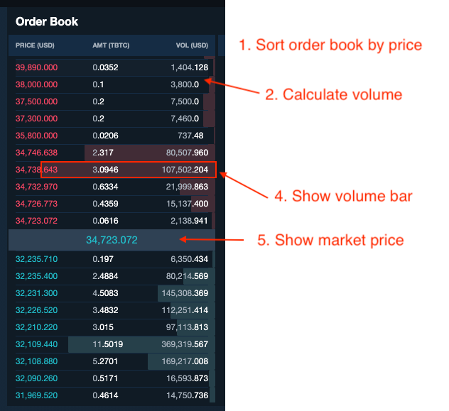

 # Zipmex frontend code challenge

Our frontend dev was working on order form and order book features but our dev is on vocation.

Assuming you are new joiner and you are assigned to continue working on this task.

---
## Before working on challenge
- Please git checkout to a new branch
- After finished the challenge, use git cmd
  - `git format-patch main -o patches`, Then zip patches folder to interviewer email.
---

## What our dev have done
- Simple order book UI to show orders
- Simple order form UI that can add order buy or sell with price and amount to orderbook

## What we expect
- Improve order form to submit order with decimal places
- Beautify Order book and order form
  - Any design are welcome
  - You can use any lib to style
- Some unit tests
  - Eg. utility function or UI that have condition
- Improve codebase
  - Show us what you got !

---
## Orderbook example

